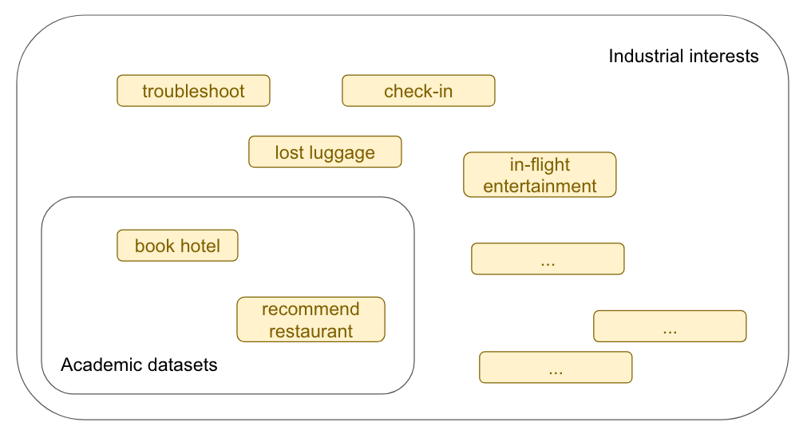
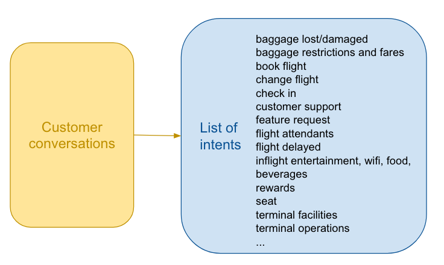
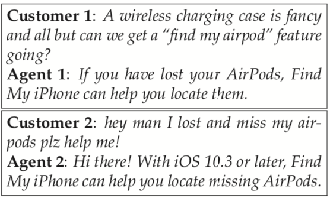
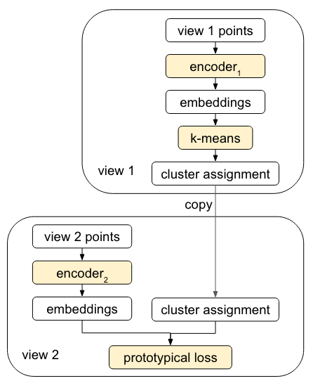
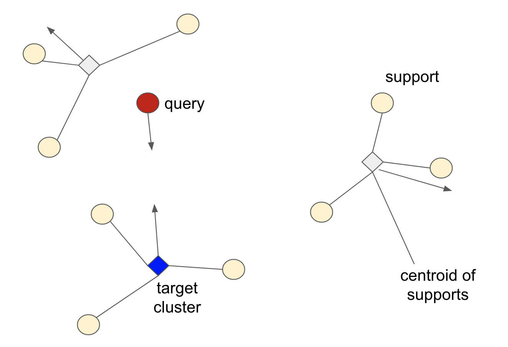
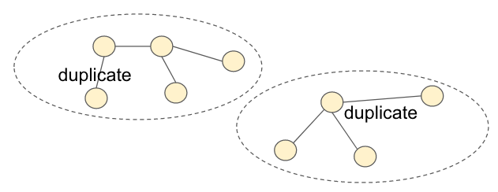
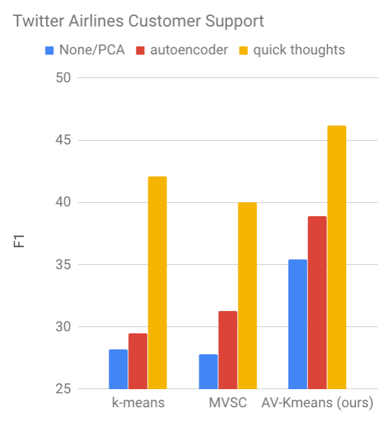
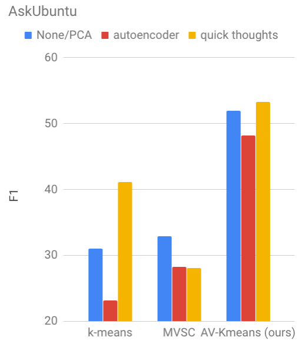

Code and data for paper ["Dialog Intent Induction with Deep Multi-View Clustering"](https://arxiv.org/abs/1908.11487), Hugh Perkins and Yi Yang, 2019, to appear in EMNLP 2019.

Data is available in the sub-directory [data](data), with a specific [LICENSE](data/LICENSE) file.

# Dialog Intent Induction

## The Gap between Academics and Industry



- **Academic dialog** datasets such as ATIS and MultiWoZ assume dialog intents are given;
- They also focus on simple dialog intents like `BookRestaurant` or `BookHotel`.
- Many complex dialog intents emerge in **industrial settings** that are hard to predefine;
- The dialog intents are also undergoing dynamic changes.

## The New Task: Dialog Intent Induction



- Automatic discovery of dialog intents from human-human conversations.
- Unsupervised clustering of user query utterances into dialog intents.
- Heuristic: user query utterance is the first user utterance.

# Multi-View Clustering (MVC)

## Why Multi-View?

Example dialogs for `FindAirPods`:



- **Query view**: the user query utterances are lexically and syntactically dissimilar;
- **Content view**: however, the solution trajectories are similar.

## Classical Multi-View Clustering


- Multi-view clustering seeks to reconcile the clusters from multiple views.
- Standard MVC algorithms expect fixed feature vectors as inputs.

# Joint Representation Learning and MVC

## Representation Learninig is Powerful

- SOTA models can capture semantic variations, e.g., BERT, ELMo.
- Can we **jointly learn representations and multi-view cluster assignments**?

## Our approach: Alternatinve-View K-Means



- We perform clustering on view 1 and project the assignment to view 2 for classification.
- The encoders are fixed for clustering and updated for classification.

## Prototypical Episode Training



- Minimizing prototypical loss encourages the query point to be closer to the target cluster.
- We directly perform classification in the k-means clustering space without introducing additional softmax parameters.

## Parameter Initialization

- Recurrent autoencoders 
- Quick thoughts

# New Datasets

## Twitter Airlines Customer Support (TwACS)

- We use dialogs in the airline industry from the Kaggle Twitter Support dataset.
- 43,072 unlabeled dialogs. We annotated 500 dialogs to create a test set.
- End up with 14 dialog intents.

## AskUbuntu Duplicate Question Clusters}



- We construct a duplicate question graph where duplicated questions are connected.
- We adopt the largest 20 clusters that contain 4,692 questions for evaluation.

# Experiments

## Competitive Clustering Methods

- k-means
- [Multi-View Spectral Clustering (MVSC)](https://github.com/mariceli3/multiview)
- `AV-Kmeans`

## Pretraining Methods

- PCA/None(`AV-Kmeans`)
- Autoencoders
- [Quick thoughts](https://arxiv.org/pdf/1803.02893.pdf)

## TwACS Results

- # of unlabeled training instances: 43,072
- # of test instances: 500



## AskUbuntu Results

- # of unlabeled training instances: 257,173
- # of test instances: 4,692



- `AV-Kmeans` largely outperforms single-view and classical multi-view clustering methods.
- Quick thoughts pretraining leads to better results than PCA and autoencoders.
- Given more training instances, `AV-Kmeans` is less dependent on pretraining.

# Usage

## Pre-requisites

- decompress the `.bz2` files in `data`folder
- download http://nlp.stanford.edu/data/glove.840B.300d.zip, and unzip `glove.840B.300d.txt` into `data` folder

## To run AV-Kmeans

- run one of:
```
# no pre-training
python train.py --pre-epoch 0 --data-path data/airlines_processed.csv --num-epochs 50 --view1-col first_utterance --view2-col context

# ae pre-training
python train.py --pre-model ae --pre-epoch 20 --data-path data/airlines_processed.csv --num-epochs 50 --view1-col first_utterance --view2-col context

# qt pre-training
python train.py --pre-model qt --pre-epoch 10 --data-path data/airlines_processed.csv --num-epochs 50 --view1-col first_utterance --view2-col context
```
- to train on askubuntu, replace `airlines` with `askubuntu` in the above command-lines

## To run k-means baseline

- for qt pretraining run:
```
python train_qt.py --data-path  data/airlines_processed.csv --pre-epoch 10 --view1-col first_utterance --view2-col context --scenarios view1
```
- to train on askubuntu, replace `airlines` with `askubuntu` in the above command-line

