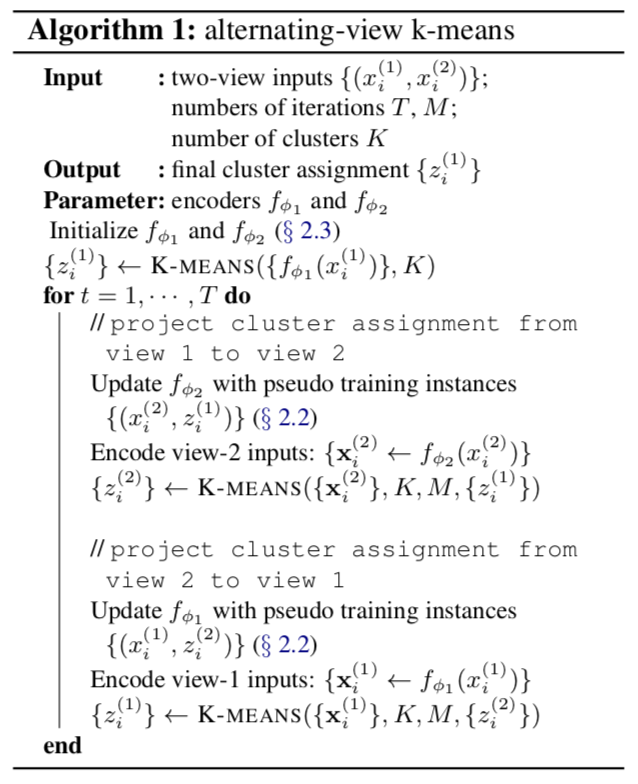

Code and data for paper ["Dialog Intent Induction with Deep Multi-View Clustering"](https://arxiv.org/abs/1908.11487), Hugh Perkins and Yi Yang, 2019, to appear in EMNLP 2019.

Data is available in the sub-directory [data](data), with a specific [LICENSE](data/LICENSE) file.

# Concept: Dialog Intent Induction

## Designing user intents is hard

- Existing dialog classification work assumes that target intents are given
- In industry, a classifier may have hundreds of intents
- their discovery involves considerable human effort

## Automatic discovery of dialog intents from data

- We aim to automatically cluster conversations into intents
- A key challenge is to learn an effective conversation encoder, in an unsupervised way
- ... such that distance in embedding space relates closely to human perceived semantic distance


# Multiview Clustering

Consider two dialogs for FindAirPods:


- The user query utterances are lexically and syntactically dissimilar
- The solution trajectories are similar
- We leverage the solution trajectory as a weak supervision signal


- Multi-view clustering seeks to reconcile the clusters from multiple views
- However classic multi-view clustering uses fixed encoders

# Deep Multiview Clustering using AV-KMeans

We propose the AV-Kmeans algorithm, to jointly learn the encoder and the cluster assignment:

<!-- 


 -->


- The encoder is fixed for clustering, and updated for classification
- we use prototypical loss for the classification task

# Usage

## Pre-requisites

- decompress the `.bz2` files in `data`folder
- download http://nlp.stanford.edu/data/glove.840B.300d.zip, and unzip `glove.840B.300d.txt` into `data` folder

## To run AV-Kmeans

- run one of:
```
# no pre-training
python train.py --pre-epoch 0 --data-path data/airlines_processed.csv --num-epochs 50 --view1-col first_utterance --view2-col context

# ae pre-training
python train.py --pre-model ae --pre-epoch 20 --data-path data/airlines_processed.csv --num-epochs 50 --view1-col first_utterance --view2-col context

# qt pre-training
python train.py --pre-model qt --pre-epoch 10 --data-path data/airlines_processed.csv --num-epochs 50 --view1-col first_utterance --view2-col context
```
- to train on askubuntu, replace `airlines` with `askubuntu` in the above command-lines

## To run k-means baseline

- for qt pretraining run:
```
python train_qt.py --data-path  data/airlines_processed.csv --pre-epoch 10 --view1-col first_utterance --view2-col context --scenarios view1
```
- to train on askubuntu, replace `airlines` with `askubuntu` in the above command-line

